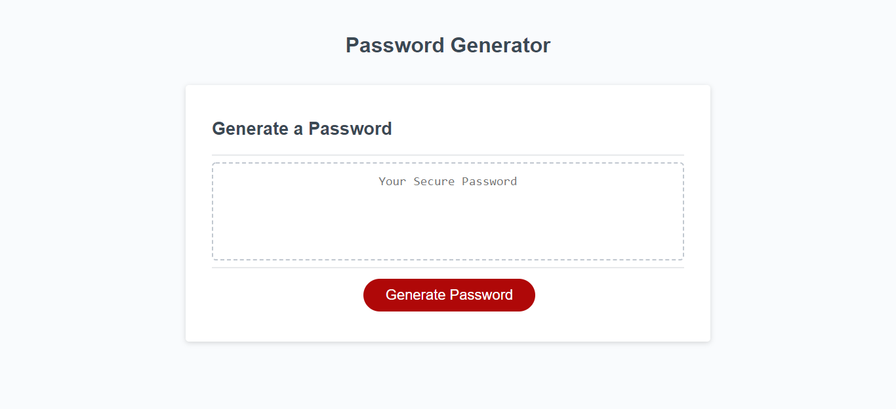
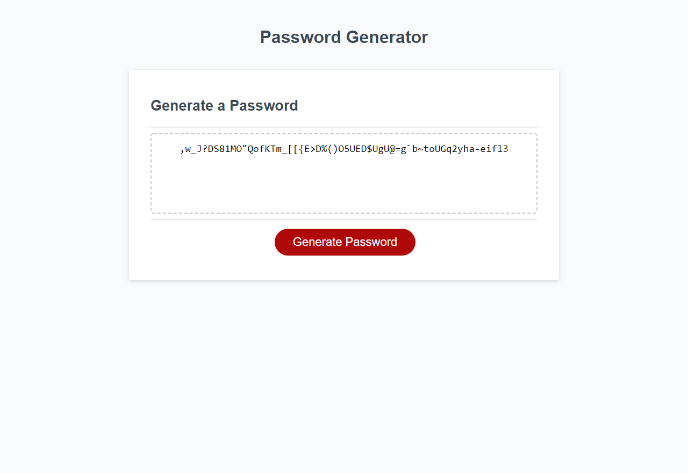
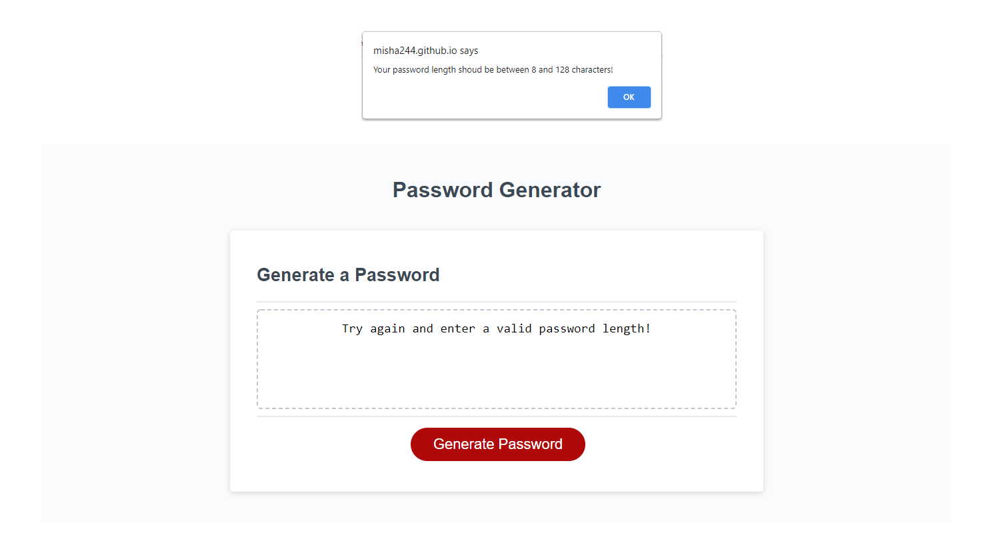
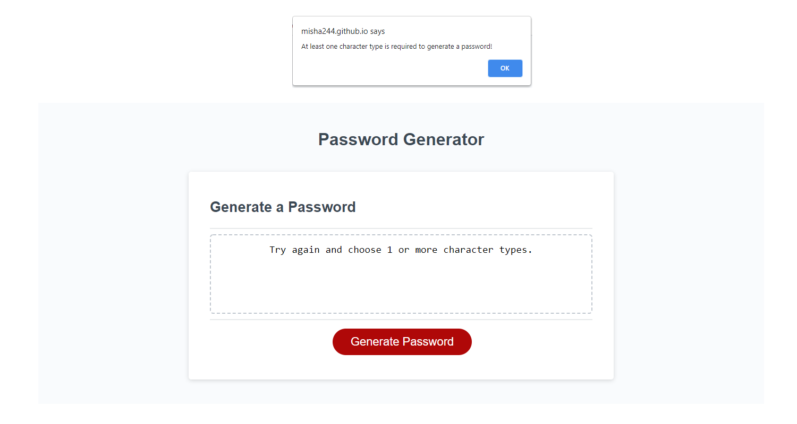

## Password Generator

## Table of content :

- [_Project Link_](#project-link)
- [_About my Project_](#about-my-project)
- [_About the Process_](#about-the-process)
- [_Screenshots_](#screenshots)

## Project Link

[_See my password generator here_](https://misha244.github.io/password_generator/)

## About my Project

The task at hand was to create a random password generator. The conditions included:

- a length between 8 and 128 characters
- one or more of four types of characters:
  - lowercase
  - uppercase
  - numeric
  - special

Starter code was provided, with the HTML and CSS pages completed. My responsibility was to write the JavaScript and provide functionality to the page.

## About the Process

A list of what I did to build the password generator:

- Declare the global variables, which contained the character options arrays.
- Create a variable to store the password, once generated.
- Add a prompt for the password length, which was then stored in a variable.
- Convert said password length into an Integer and check whether if fits the min/max length requirements.
- Collect character type preferences and ensure at least one was selected.
- Using the previously selected characters, generate a password - using the arrays and a math function, it randomly generates a sequence of characters with the length that the user has chosen.

## Screenshots

#### Landing Page

#### Generated Password example

#### Error Message - Invalid Length

#### Error Message - No Type Selected

## Fin
